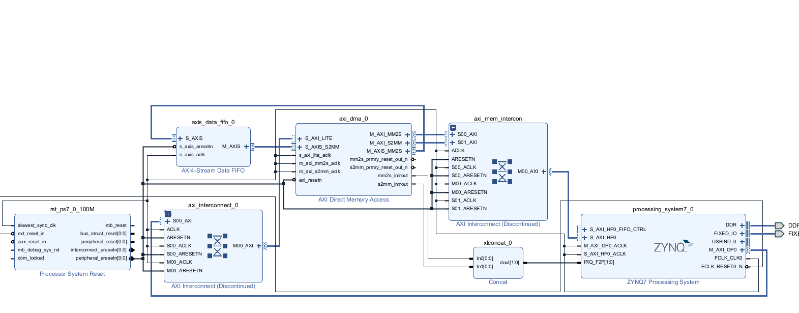
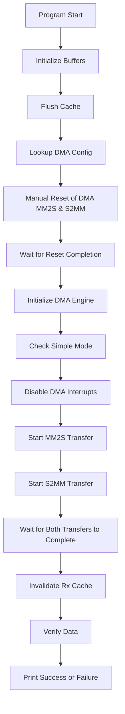
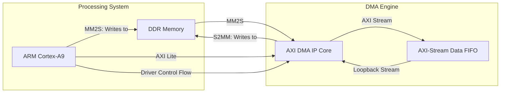

# Understanding AXI DMA in Embedded Systems

## Introduction to DMA (Direct Memory Access)

Direct Memory Access (DMA) is a feature that allows hardware subsystems to access main system memory independent of the CPU. DMA is designed to offload data movement tasks from the CPU, allowing it to perform other operations while data transfers occur in parallel, thus improving overall system performance.

## Basic DMA Concepts

1. **Why DMA is needed**:
   - Reduces CPU overhead for data transfers
   - Increases system throughput
   - Essential for high-speed data movement applications

2. **Key DMA operations**:
   - Memory-to-Memory transfers
   - Memory-to-Device transfers (MM2S: Memory-Mapped to Stream)
   - Device-to-Memory transfers (S2MM: Stream to Memory-Mapped)

3. **DMA Transfer Modes**:
   - **Simple Mode**: Direct point-to-point transfers
   - **Scatter-Gather Mode**: Multiple discontinuous memory regions can be transferred using descriptor chains

## AXI DMA Architecture

AXI (Advanced eXtensible Interface) DMA is a specific implementation of DMA used in Xilinx FPGA and SoC platforms. Based on the code, we can infer the following hardware architecture:

```
+---------------+    +----------------+    +---------------+
|               |    |                |    |               |
| System Memory |<-->| AXI DMA Engine |<-->| Hardware IP   |
|               |    |                |    | (Accelerator) |
+---------------+    +----------------+    +---------------+
        ^                    ^
        |                    |
        v                    v
+------------------------------------------+
|                                          |
|            Processing System             |
|          (CPU, Cache, etc.)              |
|                                          |
+------------------------------------------+
```

The AXI DMA hardware typically includes:
- MM2S Channel (Memory-Mapped to Stream)
- S2MM Channel (Stream to Memory-Mapped)
- Control and Status Registers
- Buffer Descriptor Management (for Scatter-Gather mode)

## Analyzing the Loopback Test Program

The provided code implements a loopback test for an AXI DMA engine. Here's a breakdown of what it does:

### 1. Setup Phase
- Defines memory regions for transmit and receive buffers
- Sets up test parameters (packet length, timeout limits)
- Initializes buffers with test data

### 2. DMA Configuration
- Looks up DMA device configuration
- Manually resets both MM2S and S2MM channels
- Initializes the DMA with configuration settings
- Confirms simple mode (non Scatter-Gather) operation
- Disables interrupts for polling-based operation

### 3. Data Transfer
- Initiates MM2S transfer (Memory to Device)
- Initiates S2MM transfer (Device to Memory)
- Polls DMA status registers while waiting for completion
- Implements timeout protection to prevent infinite loops

### 4. Verification
- Invalidates cache for the receive buffer to ensure fresh data
- Compares received data with transmitted data
- Reports success or failure

## Technical Implementation Details

1. **Memory Management**:
   - Fixed memory regions are used (base address: 0x10000000)
   - Transmit buffer at offset 0x00100000
   - Receive buffer at offset 0x00300000
   - 256 bytes (0x100) transfer size

2. **Cache Handling**:
   - Cache is properly managed with flush and invalidate operations
   - Ensures memory coherency between CPU and DMA engine

3. **Register Access**:
   - Direct register access for manual reset operations
   - Use of driver API for standard operations
   - Polling of status registers to detect completion

4. **Error Handling**:
   - Timeout protection for all waiting operations
   - Detailed status reporting for debugging
   - Early termination on failure conditions

## Hardware Implementation Inference

Based on the software interface, we can infer that the hardware likely consists of:

1. **AXI DMA IP Core** with:
   - MM2S channel (TX path)
   - S2MM channel (RX path)
   - AXI4 interface to system memory
   - AXI4-Stream interfaces to hardware accelerators

2. **Loopback Configuration**:
   - The program suggests a loopback configuration where the output of the MM2S channel is connected back to the input of the S2MM channel
   - This could be either internal to the DMA or through an external loopback connection

3. **Memory Mapping**:
   - Fixed memory regions for buffers suggest a non-cached or cache-coherent memory region
   - Address range suggests this might be in DDR memory accessible to both PS (Processing System) and PL (Programmable Logic)

4. **Register Map**:
   - Control registers at BaseAddr + 0x00 for MM2S
   - Control registers at BaseAddr + 0x30 for S2MM
   - Status registers accessed via XAXIDMA_SR_OFFSET

## Common Applications

AXI DMA is commonly used in:
1. Image/video processing accelerators
2. Signal processing algorithms
3. Data acquisition systems
4. High-speed data logging
5. Custom hardware accelerators requiring high-bandwidth memory access

## Conclusion

The AXI DMA provides a powerful mechanism for moving data between system memory and hardware accelerators implemented in FPGA fabric. The loopback test demonstrates proper initialization, configuration, and operation of the DMA channels, validating that data can be correctly moved to and from memory without CPU intervention for the actual data movement. 



### 🧭 DMA Call Flow (Mermaid Diagram)


### 🧱 DMA Structural Diagram (Mermaid Diagram)


